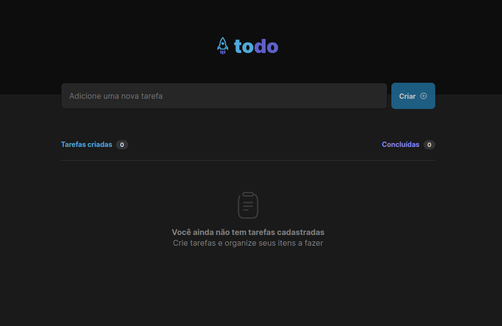
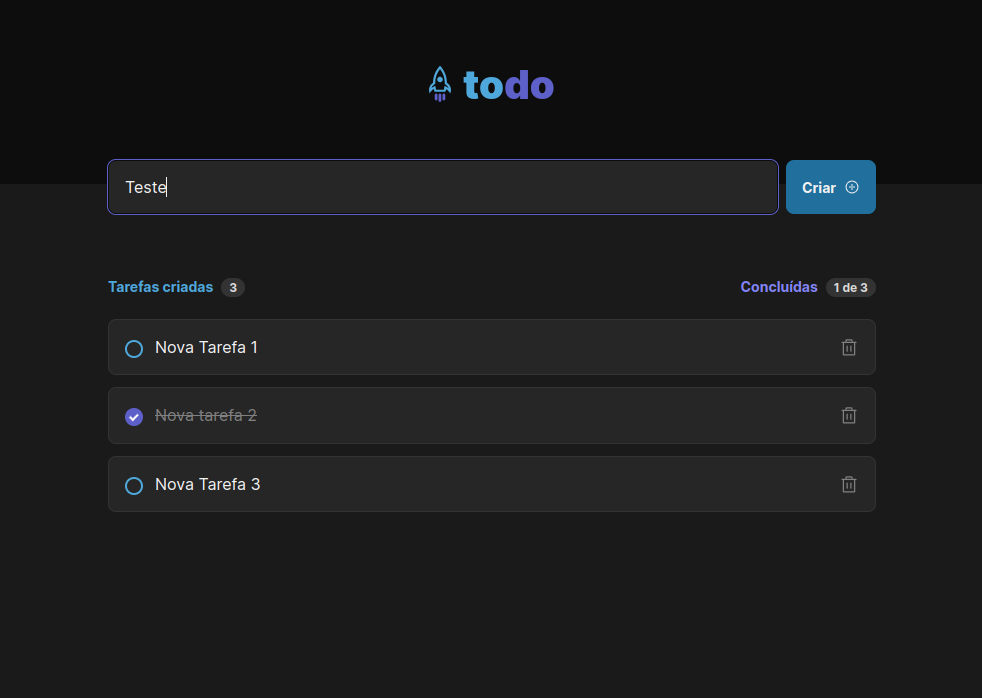

# Todo List

Projeto desenvolvido durante a formação em React da Rocketseat. Criado com o objetivo de aprimorar habilidades em React e TypeScript, esse projeto consiste em uma lista de tarefas. Permite a adição de novas tarefas, marcação como resolvidas e exclusão das mesmas.

## Tecnologias

As seguintes ferramentas foram tilizadas na construção do projeto:


## Screenshot

<div align="center">
    
    
</div>

## Como rodar a aplicação

Para o download do projeto, siga as instruções abaixo:

```
1. git clone https://github.com/mateusgs29/todo-list.git
2. cd todo-list
```

Instale as dependências e inicie o projeto:

```
1. npm install
2. npm run dev
```
